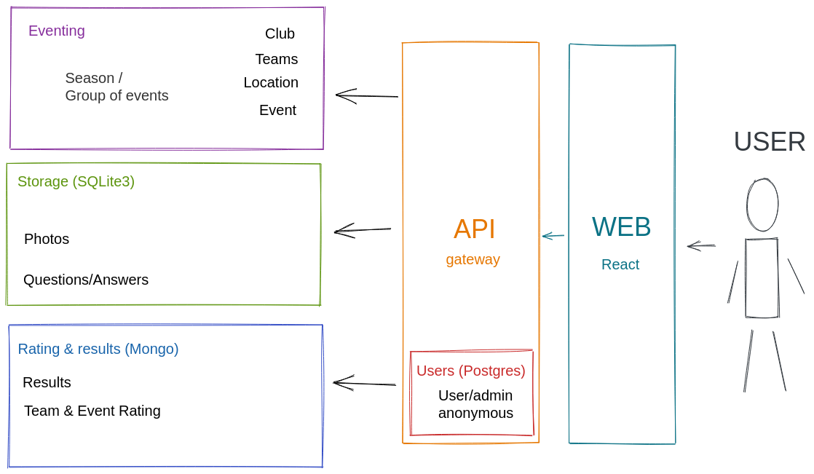

# DAA project

## Overview



## Installation & usage

To run in a container, please install `docker` and `docker-compose`.

Run `docker-compose up` to build and run the entire system, then open `localhost:8080` in your browser.

## Setup

To setup API Gateway, run

```bash
docker-compose run gateway bash

# inside the shell
rails db:create db:migrate db:seed
```

## API
### Clubs
#### `GET api/v1/clubs` - list of clubs
Response:
```json
{
  "data": {
    "clubs": [
      {
        "id":       123,
        "city":     "Chisinau",
        "address":  "Chisinau, some street",
        "contacts": {
          "representative": "John Doe",
          "phone":          "+123456789",
          "email":          "foo@bar.baz"
        },
      }
    ]
  }
}
```

#### `GET api/v1/clubs/:id` - detailed data about a club
Response:
```json
{
  "data": {
    "club": {
      "id":           123,
      "city":         "Chisinau",
      "address":      "Chisinau, some street",
      "founded_on":   "2010-10-10",
      "description":  "very long description + html",
      "active_teams": 10,
      "total_teams":   50,
      "contacts":     {
        "representative": "John Doe",
        "phone":          "+123456789",
        "email":          "foo@bar.baz"
      }
    }
  }
}
```

#### `POST /api/v1/clubs` - create a club
Payload:
```json
{
  "club": {
    "city":        "Chisinau",
    "address":     "Chisinau, some street",
    "founded_on":  "2010-10-10",
    "description": "very long description + html",
    "contacts":    {
      "representative": "John Doe",
      "phone":          "+123456789",
      "email":          "foo@bar.baz"
    }
  }
}
```

Response:
```json
{
  "data": {
    "club": {
      "id":           123,
      "city":         "Chisinau",
      "address":      "Chisinau, some street",
      "founded_on":   "2010-10-10",
      "description":  "very long description + html",
      "active_teams": 10,
      "total_teams:   50,
      "contacts":     {
        "representative": "John Doe",
        "phone":          "+123456789",
        "email":          "foo@bar.baz"
      }
    }
  }
}
```

#### `DELETE /api/v1/clubs/:id` - remove a club by ID

#### `PUT /api/v1/clubs/:id` - update a club
Payload:
```json
{
  "club": {
    "city":        "Chisinau",
    "address":     "Chisinau, some street",
    "founded_on":  "2010-10-10",
    "description": "very long description + html",
    "contacts":    {
      "representative": "John Doe",
      "phone":          "+123456789",
      "email":          "foo@bar.baz"
    }
  }
}
```
Response:
```json
{
  "data": {
    "club": {
      "id":           123,
      "city":         "Chisinau",
      "address":      "Chisinau, some street",
      "founded_on":   "2010-10-10",
      "description":  "very long description + html",
      "active_teams": 10,
      "total_teams:   50,
      "contacts":     {
        "representative": "John Doe",
        "phone":          "+123456789",
        "email":          "foo@bar.baz"
      }
    }
  }
}
```

### Events
#### `GET /api/v1/events` - all events. Query params: `group_id`, `location_query`
Response:
```json
{
  "data": {
    "events": [
      {
        "id":          123,
        "name":        "World championship",
        "long_name":    "World championship 2020",
        "description": "description",
        "cover_photo": "/api/v1/photos/1234",
        "dates": {
          "start_date": "2010-01-01 10:00",
          "end_date": "2010-01-01 15:00"
        },
        "registration": {
          "status":          "open",
          "fee":             "10 MDL/person",
          "registation_end": "2010-01-01 09:  00"
        }
      }
    ]
  }
}
```

#### `GET /api/v1/events/:id` - detailed info about an event

Response:
```json
{
  "data": {
    "event": {
      "id":          123,
      "name":        "World championship",
      "long_name":    "World championship 2020",
      "description": "description",
      "cover_photo": "/api/v1/photos/1234",
      "dates": {
        "start_date": "2010-01-01 10:00",
        "end_date":   "2010-01-01 15:00"
      },
      "registration": {
        "status":          "open",
        "fee":             "10 MDL/person",
        "registation_end": "2010-01-01 09:00"
      },
      "teams": [
        {
          "id":    456,
          "name": "Echipa Racheta"
        }
      ]
    }
  }
}
```

#### `POST /api/v1/events` - create an event
Payload:
```json
{
  "event": {
    "name":        "World championship",
    "long_name":    "World championship 2020",
    "description": "description",
    "cover_photo": "/api/v1/photos/1234",
    "dates": {
      "start_date": "2010-01-01 10:00",
      "end_date":   "2010-01-01 15:00"
    },
    "registration": {
      "status":          "open",
      "fee":             "10 MDL/person",
      "registation_end": "2010-01-01 09:00"
    }
  }
}
```

Response:
```json
{
  "data": {
    "event": {
      "id":          123,
      "name":        "World championship",
      "long_name":    "World championship 2020",
      "description": "description",
      "cover_photo": "/api/v1/photos/1234",
      "dates": {
        "start_date": "2010-01-01 10:00",
        "end_date":   "2010-01-01 15:00"
      },
      "registration": {
        "status":          "open",
        "fee":             "10 MDL/person",
        "registation_end": "2010-01-01 09:00"
      }
    }
  }
}
```


#### `PUT /api/v1/events/:id` - update an event
Payload:
```json
{
  "event": {
    "name":        "World championship",
    "long_name":    "World championship 2020",
    "description": "description",
    "cover_photo": "/api/v1/photos/1234",
    "dates": {
      "start_date": "2010-01-01 10:00",
      "end_date":   "2010-01-01 15:00"
    },
    "registration": {
      "status":          "open",
      "fee":             "10 MDL/person",
      "registation_end": "2010-01-01 09:00"
    }
  }
}
```

Response:
```json
{
  "data": {
    "event": {
      "id":          123,
      "name":        "World championship",
      "long_name":    "World championship 2020",
      "description": "description",
      "cover_photo": "/api/v1/photos/1234",
      "dates": {
        "start_date": "2010-01-01 10:00",
        "end_date":   "2010-01-01 15:00"
      },
      "registration": {
        "status":          "open",
        "fee":             "10 MDL/person",
        "registation_end": "2010-01-01 09:00"
      }
    }
  }
}
```

#### `DELETE /api/v1/events/:id` - remove an event

#### `POST /api/v1/events/:id/registration` - register to an event as a team
Payload:
```json
{
  "team": {
    "name":   "Echipa Racheta",
    "captain: "John Doe",
    "phone":  "+123456789"
  }
}
```

Response
```json
{
  "data": {
    "registered": true
  }
}
```

### Teams
#### `GET /api/v1/teams` - all teams ever registered to an event
Response:
```json
{
  "data": {
    "teams": [
      {
        "id":   123,
        "name": "Echipa Racheta"
      }
    ]
  }
}
```

#### `GET /api/v1/teams/:id` - detailed info about a team
Response:
```json
{
  "data": {
    "team": {
      "name": "Echipa Racheta",
      "captain": "John Doe",
      "phone": "+123456789"
    }
  }
}
```

#### `POST /api/v1/teams` - create a team
Payload:
```json
{
  "team": {
    "name":   "Echipa Racheta",
    "captain": "John Doe",
    "phone":  "+123456789"
  }
}
```

Response:
```json
{
  "data": {
    "team": {
      "name": "Echipa Racheta",
      "captain": "John Doe",
      "phone": "+123456789"
    }
  }
}
```


#### `PUT /api/v1/teams/:id` - update a team
Payload:
```json
{
  "team": {
    "name":   "Echipa Racheta",
    "captain": "John Doe",
    "phone":  "+123456789"
  }
}
```

Response:
```json
{
  "data": {
    "team": {
      "name": "Echipa Racheta",
      "captain": "John Doe",
      "phone": "+123456789"
    }
  }
}
```


### Question store
#### `GET /api/v1/question_packs` - get a list of available question packs. Query params: `difficulty`
Response:
```json
{
  "data": {
    "question_packs": [
      { "id": 1, "event_name": "Super Cup", "event_id": "12345", "difficulty": "medium" }
    ]
}
```

#### `GET /api/v1/question_packs/:id` - get metadata about a pack of questions
Response:
```json
{
  "data": {
    "question_pack": {
       "id": 1,
       "author": "anonymous",
       "event_name": "Super Cup",
       "event_id": "12345",
       "difficulty": "medium",
       "user_id": "123"
    }
  }
}
```

#### `GET /api/v1/question_packs/random` - get metadata of a random pack of questions. Query params: `difficulty`
```json
{
  "data": {
    "question_pack": {
       "id": 1,
       "author": "anonymous",
       "event_name": "Super Cup",
       "event_id": "12345",
       "difficulty": "medium",
       "user_id": "123"
    }
  }
}
```

#### `GET /api/v1/question_packs/:id/blob` - get a pack of questions.
Response: binary doc or PDF

#### `POST /api/v1/question_packs` - store the pack of questions
Payload:
```json
{
  "question_pack": {
     "author": "anonymous",
     "blob": "Base64(binary)",
     "event_name": "Super Cup",
     "event_id": "12345",
     "difficulty": "medium",
     "user_id": "123"
  }
}
```

#### `DELETE /api/v1/question_packs/:id` - remove a pack of questions

#### `PUT /api/v1/question_packs` - update metadata or content of a pack of questions
Payload:
```json
{
  "question_pack": {
     "author": "anonymous",
     "blob": "Base64(binary)",
     "event_name": "Super Cup",
     "event_id": "12345",
     "difficulty": "medium"
  }
}
```

#### `POST /api/v1/photos` - save a photo
Payload:
```json
{
  "photo": {
    "title": "some title",
    "blob": "Base64(binary)"
  }
}
```

#### `GET /api/v1/photos/1` - get a photo thumbnail

### Results (results & stats microservice)
#### `GET /api/v1/results/:id` - all results for an event
Response:
```json
{
  "data": {
    "result": [
        {
          "team_name": "team1",
          "total_score": 3,
          "score": [
            { "round": 1, "count": 0},
            { "round": 2, "count": 3}
          ]
        }
     ]
  }
}
```

#### `GET /api/v1/results/:id/details` - detailed results/stats e.g. answers for each question
Response:

```json
{
  "data": {
    "result": [
        {
          "team_name": "team1",
          "total_score": 3,
           "score": [
             { "round": 1, "count": 0, "score": [0,0,0,0,0,0,0,0,0,0]},
             { "round": 2, "count": 3, "score": [0,1,0,0,0,0,0,1,0,1]}
           ]
        }
     ]
  }
}
```

#### `POST /api/v1/results` - create results
Payload:
```json
{
  "result": [
    {
      "team_name": "team1",
      "score": [
         { "round": 1, "score": [0,0,0,0,0,0,0,0,0,0]},
         { "round": 2, "score": [0,1,0,0,0,0,0,1,0,1]}
       ]
    }
  ]
}
```
#### `DELETE /api/v1/results/:id` - delete results for some event


### User management
#### `GET /api/v1/users` - list of users
Response:
```json
{
  "data": {
    "users": [
      { "id": 1, "name": "name", "email": "email@email.com", "roles": [] }
    ]
}
```
#### `GET /api/v1/users/me` - information about current user
Response:
```json
{
  "data": {
    "user": {
      "id": 1,
      "name": "name",
      "email": "email@email.com",
      "roles": ["manage_events", "manage_clubs"]
    }
}
```
#### `GET /api/v1/users/:id` - basic information about a certain user
Response:
```json
{
  "data": {
    "user": {
      "id": 1,
      "name": "name",
      "email": "email@email.com",
      "roles": ["manage_events", "manage_clubs"]
    }
}
```
#### `PUT /api/v1/users/:id` - update a certain user
Payload:
```json
{
  "user": {
    "name": "name",
    "email": "email@email.com"
  }
}
```
#### `DELETE /api/v1/users/:id` - remove a certain user

### Role management
#### `GET /api/v1/users/:id/roles` - list of roles of a user
Response:
```json
{
  "data": {
    "roles": ["manage_events", "manage_clubs"]
  }
}
```

#### `POST /api/v1/users/:id/roles` - add a list of roles to a user
Payload:
```json
{
  "roles": ["manage_events"]
}
```

#### `DELETE /api/v1/users/:id/roles` - remove a list of roles from a user
Payload:
```json
{
  "roles": ["manage_events"]
}
```

### Authentication

#### `POST /users` - sign up as a user
Payload:
```json
{
  "user": {
    "email": "email@email.com",
    "password": "password",
    "password_confirmation": "password"
  }
}
```
#### `POST /users/sign_in` - sign in and get JWT
Payload:
```json
{
  "user": {
    "email": "email",
    "password": "password"
  }
}
```
#### `DELETE /users/sign_out` - sign out and invalidate JWT


